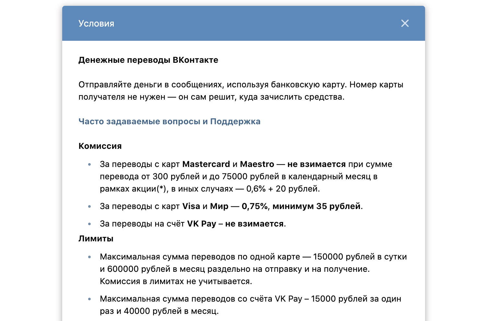

## Задача №1 - Денежные переводы

Сейчас можно легко и просто отправить денежный перевод практически через любую систему.

Например, мы можем отправлять переводы через VKontakte:

При этом берётся определённая комиссия за совершение перевода:

Упрощенная задача: за переводы с любых карт комиссия 0.75%, минимум 35 рублей.

Приложение должно высчитывать комиссию, которую заплатит пользователь при переводе — комиссия также должна быть в копейках.

